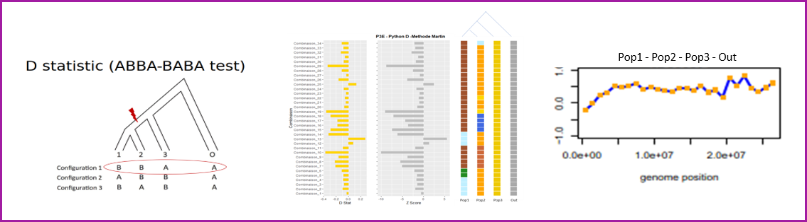

# *Musa_ABBA_BBAA_Introgession*

## Introduction

Hybridization between species represents a major force of evolution, influenced by the external element, as glacial period, migration species or climatic changes, The genome can evolved by providing material for adaptation by natural and or sexual selection. Hybridization can decrease the difference between two species by sharing alleles across the genome, but can also act as a source of variation, impacting adaptation, aiding in evolutionary rescue, promoting range expansion, leading to species divergence, and finally fueling adaptative radiation.  

Since the beginning of  next generation sequencing, and because of the decreasing cost,  the number of whole-genome sequencing increase. Associated to new statistical methods to detect the signature of hybridization at the whole genome or chromosome level, genome sequencing technic provide an information patterns (SNP) across a tree as markers of hybridization. 

Purpose of Musa_ABBA_BBAA_Introgession
--------------------------------------

Table of content

## Table of contents

- [**How to cite**](#How-to-cite)
- [**Introduction**](#Introduction)
  - ABBA_BBAA Test
  - Python Test
  - R Test
- [**Workflow - Calculate ABBA_BBA Python test**](#workflow---molecular-karyotype-analysis)
  - Input raw data
  - Read Quality check
  - **Step a : Mapping reads on the reference**
  - DNA Data
  - RNA Data
  - **Step b : Variant discovery**
- [**Workflow - Calculate ABBA_BBA R test**](#workflow---molecular-karyotype-analysis)
  - Merge datasets
  - Filter SNP dataset
  - Split VCF by chromosome
  - Generate molecular karyotype
- [**Authors and acknowledgments**](#authors-and-acknowledgment) 
- [**Contact**](#contact) 

How to cite
-----------

Filling the gaps in gene banks: Collecting, characterizing and phenotyping wild banana relatives of Papua new guinea David Eyland, Catherine Breton, Julie Sardos, Simon Kallow, Bart Panis, Rony Swennen, Janet Paofa, François Tardieu, Claude Welcker Steven B. Janssens, Sebastien C. Carpentier. *Crop Science* https://doi.org/10.1002/csc2.20320  

  
If you use the second workflow.

A protocol for detection of large chromosome variations in banana using Next Generation Sequencing. Breton Catherine, Cenci Alberto, Sardos Julie, Chase Rachel, Ruas Max, Rouard Mathieu & Roux Nicolas Published in October. Under review.

## Authors and acknowledgments

This work is a collaborative work between Catherine Breton, Yann Huber, Mathieu Rouard with the participation, and the use of scripts from Guillaume Martin (CIRAD) who develops and maintains VCFHunter.

## Contact

**Catherine Breton**, Alliance of Bioversity International and CIAT Europe (c.breton@cgiar.org)

The Alliance of Bioversity International and the International Center for Tropical Agriculture (CIAT)
delivers research-based solutions that harness agricultural biodiversity and sustainably transform
food systems to improve people’s lives in a climate crisis.
The Alliance is part of CGIAR, a global research partnership for a food-secure future.
https://www.bioversityinternational.org/       
https://www.ciat.cgiar.org

