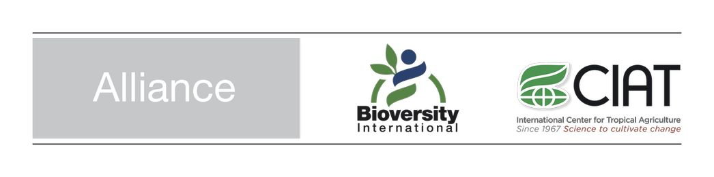

# *Musa_ABBA_BBAA_Introgession

Purpose of Musa_ABBA_BBAA_Introgession
--------------------------------------

## Authors and acknowledgments

This work is a collaborative work between Catherine Breton, Yann Huber, Mathieu Rouard with the participation, and the use of scripts from Guillaume Martin (CIRAD) who develops and maintains VCFHunter.

## Contact

**Catherine Breton**, Alliance of Bioversity International and CIAT Europe (c.breton@cgiar.org)

The Alliance of Bioversity International and the International Center for Tropical Agriculture (CIAT)
delivers research-based solutions that harness agricultural biodiversity and sustainably transform
food systems to improve people’s lives in a climate crisis.
The Alliance is part of CGIAR, a global research partnership for a food-secure future.
https://www.bioversityinternational.org/       
https://www.ciat.cgiar.org

